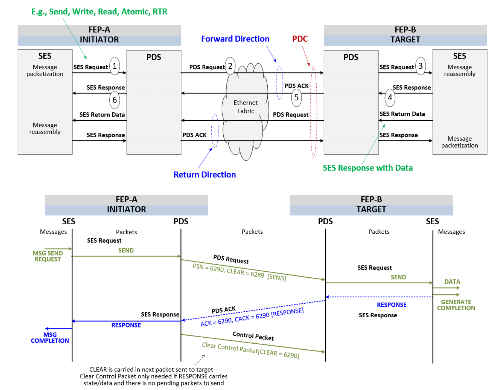
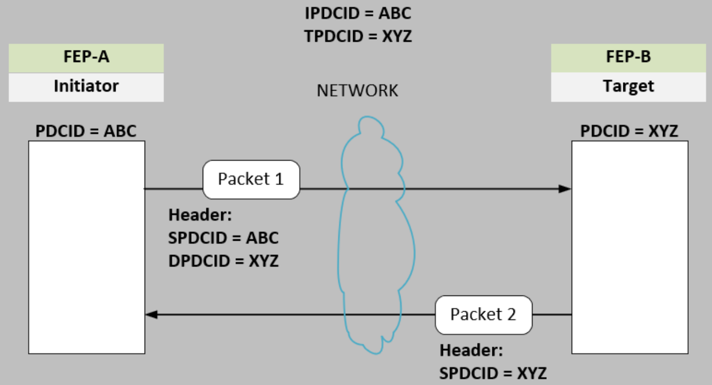

### 3.5.1 PDS 术语

表 3-25 总结了 PDS 中使用的术语。本节及其他传输层章节中均使用了这些术语。其中部分术语已在《UE 规范》的前言第 1.2.2 节中定义，此处再次列出是为了提供更多上下文信息。

#### 表 3-25 - PDS 术语

| 术语（Term） | 描述（Description） |
|-------------|---------------------|
| **ACK** | 确认（Acknowledgement） |
| **CC** | 拥塞控制（Congestion control，也称为拥塞管理） |
| **CCC** | 拥塞控制上下文（Congestion control context） • 用于控制 RUD/ROD 中某一方向上的流量拥塞 |
| **Clear** | 用于对 ACK 进行确认，当该 ACK 需要**保证交付**时使用；即该 ACK 携带必须送达的语义状态，例如错误信息或返回数据 |
| **CP** | 用于 RUD 和 ROD 传输服务的一种控制数据包类型（Control Packet） |
| **Deferrable Send** | 延迟发送：允许目标端通过发送 NACK 指示接收缓冲区尚未准备好，稍后在缓冲区可用时再发送重启传输请求（RTR）包 |
| **DEF_RESP** | 默认响应，UET_DEFAULT_RESPONSE 的简写；该 SES 响应格式用于在多个 PSN 合并为一个 ACK 时，或当 PDS 重新生成一个非保证交付的 SES 响应时发送 ACK。 |
| **Destination** | 发送数据包的目标 FEP。 |
| **DPDCID** | 目标 PDCID：由对端 FEP（即 PDC 另一端的 FEP）分配的 PDCID。 |
| **Duplicate packet** | 重复数据包：指某个数据包第二次到达目的地，例如源端重传了一个已成功接收的数据包。对于 RUD/ROD，重复数据包不会交给 SES，并且可以被确认。 |
| **Entropy value (EV)** | 熵值：用于根据封装方式进行负载均衡。对于原生 IP 封装的 UE 数据包，EV 来源于 `pds.entropy` 头字段；对于封装在 UDP 中的 UE 数据包，EV 来源于 `udp.src_port` 字段。 |
| **Forward Direction** | 前向方向：从发起方 FEP 到目标 FEP 的 PDS 请求数据包的方向；其 ACK 则沿相反方向返回。参见图 3-39。 |
| **Forward PSN** | 分配给前向方向上的数据包（发起方请求）的 PSN，可携带返回路径上的返回数据。 |
| **GTD_DEL** | 保证交付（Guaranteed delivery）：标识从目标到发起方必须保证交付的 SES 响应（即有状态的响应），如错误事件、使用了 unexpected list、原子操作返回等。 |
| **Initiator** | 发起方 FEP：通过向另一个 FEP 发送数据包来建立 PDC 的 FEP。 |
| **IPDCID** | 发起方 PDCID：由发起 PDC 建立的 FEP 分配的 PDCID。 |
| **MID** | 消息标识符（Message Identifier）：由 SES 分配，PDS 视为不透明；用于说明图中的包序列顺序关系。一个消息由一个或多个使用相同 ID 的包组成。 |
| **MO** | 消息偏移（Message Offset）：表示某包在 SES 消息中的编号；用于说明包顺序关系。 |
| **MP_Range** | 最大 PSN 范围：定义目的端可基于资源跟踪的最大 PSN 数量；在 PDS ACK 中以压缩格式传输，使用字段 `pds.mpr`。 |
| **NACK** | 否定确认（Negative Acknowledgement） |
| **Highest PSN** | 最高 PSN 值：注意当 PSN 空间回绕时，数值较小的 PSN 可能是更新的。 |
| **OOR** | 资源耗尽（Out of Resources） |
| **PDC** | 数据包传输上下文（Packet Delivery Context）：包括前向方向和返回方向，是动态建立和关闭的临时连接。 |
| **PDS ACK** | 由 PDS 生成并通过以太网传输至另一 FEP 的 PDS 上；携带将传递至目标 SES 的 SES 响应。 |
| **PDCID** | PDC 标识符（Packet Delivery Context Identifier） |
| **PDS** | 数据包传输子层（Packet Delivery Sublayer） |
| **PDS Request** | 由 PDS 生成并通过以太网传输至另一 FEP 的 PDS；在返回方向上可携带 SES 请求或 SES 响应及数据，传送至目标 SES。 |
| **PSN** | 数据包序列号（Packet Sequence Number） |
| **Return Data** | 返回数据：目标响应 SES 请求（例如读请求）而发送给发起方的数据。可以包含在前向方向的 PDS ACK 中，或返回方向的 PDS Request 中传送。由 SES 生成并交由 PDS 发送。 |
| **Return Direction** | 返回方向：从目标 FEP 到发起 FEP 的 PDS Request 方向；其 ACK 则反向返回。参见图 3-39。 |
| **Return PSN** | 分配给返回方向上数据包（目标返回数据）的 PSN。 |
| **RTR** | 重启传输请求（Restart Transmission Request）：SES 请求，用于重启已被延迟的发送。该请求使用一个单独的 PDC，因为最初发送请求的目标现在作为发起方发送 RTR。 |
| **ROD** | 可靠有序传输（Reliable Ordered Delivery） |
| **RTO** | 重传超时（Retransmission Timeout）：在未收到 ACK 或 NACK 前定时器超时事件。 |
| **RUD** | 可靠无序传输（Reliable Unordered Delivery） |
| **RUDI** | 可幂等操作的可靠无序传输（Reliable Unordered Delivery of Idempotent Operations） |
| **SACK** | 选择性确认（Selective Acknowledgement） |
| **SES** | 语义子层（Semantic Sublayer） |
| **SES Request** | SES 生成并交给 PDS 的请求，用于要求按特定顺序和可靠性发送数据包；只有发起方可发送该请求。这些请求通过 PDS Request 转发至目标 SES。 |
| **SES Response** | SES 在接收方生成并交给 PDS 的响应，用于响应 SES Request；可能包含在 PDS ACK 或 PDS Request 中。详见图 3-39 后的描述。 |
| **SES RTR** | SES 延迟发送的“重启传输请求”；详见语义章节。 |
| **Set / Clear** | 当涉及字段时，“Set”表示为 1（b’1），"Clear" 表示为 0（b’0）。 |
| **Source** | 源 FEP：发送数据包的 FEP。 |
| **SPDCID** | 源 PDCID：由发送数据包的 FEP 分配的 PDCID（即本地分配的 PDC 标识）。 |
| **Target** | 目标 FEP：另一 FEP 发送数据包的目的地，接收请求并建立 PDC。 |
| **TC** | 业务类别（Traffic Class） |
| **TPDCID** | 目标 PDCID：由接收 PDC 建立请求的 FEP 分配的标识符。 |
| **UUD** | 不可靠无序传输（Unreliable Unordered Delivery） |

> **注释**：  
> • “Request”（首字母大写）用于表示 SES 和 PDS 的头部类型（如 SES Request）。  
> • “request”（小写）用于描述 SES 和 PDS 执行的动作（如 SES 请求发送一个数据包）。

### 3.5.2 PDS术语图解

“发起方（Initiator）” 和 “目标方（Target）” 是相对于某个具体的 PDC 而言的术语。所有 FEP 都可能同时作为发起方和目标方运行。

图 3-39 展示了一个基本交互流程，其中椭圆内的数字对应以下步骤：

1. FEP-A SES 生成 SES 请求（SES Request）。

2. 发起方生成的 PDS Request 携带 SES Request 并发送给目标方。

3. SES Request 被传递至 FEP-B SES。

4. FEP-B 的 SES 生成对该请求的 SES 响应（SES Response）。

5. 目标方生成的 PDS ACK 携带 SES Response 并返回给发起方 → 该 ACK 属于前向方向（forward direction）。

6. SES Response 被传递回 FEP-A 的 SES。

下方的箭头表示读请求（read request）的返回方向（return direction）的相同过程。**PDS ACK 不适用于拥塞控制**。返回方向用于携带大型读响应数据包 —— 该路径为从目标方到发起方，并适用于拥塞控制。小型读响应数据可以像第 3.5.12.1 节所述一样，携带在 PDS ACK 中。

请注意：大型读响应数据是在返回方向的 PDS Request 中传输的。这些数据包在图 3-39 中标记为 “SES Return Data”，在技术上它们属于 SES Responses，并使用 `pds.next_hdr` 字段，取值为 UET_HDR_RESPONSE_DATA 或 UET_HDR_RESPONSE_DATA_SMALL。

PDS Request：在前向方向承载 SES Requests，在返回方向承载带数据的 SES Responses。

PDS ACK：仅承载 SES Responses。

在本节中，“SES request”（小写）表示 SES 通过 PDS Request 发起的数据包传输请求。“SES response”（小写）表示 SES 返回的响应，通过 PDS ACK 中继传输。
使用小写字母是为了表示 PDS 的功能行为，而非 SES 的 next header 类型。

>说明性文本（Informative Text）：
PDCID的引用方式有两种不同的视角。每个PDC都有一个发起方FEP和一个目标FEP。这些在PDC的整个生命周期中都是固定的。还有一个源FEP和目标FEP。它们是相对于发送数据包的FEP来说的。即：
> - IPDCID：由发起方 FEP 分配的 PDCID
> - TPDCID：由目标方 FEP 分配的 PDCID
> - SPDCID：由生成并发送数据包的 FEP 分配的 PDCID
> - DPDCID：由接收数据包的 FEP 分配的 PDCID
> - SPDCID 和 DPDCID 被携带在 PDS 报文头中，分别对应字段 `pds.spdcid` 和 `pds.dpdcid`
> 
> 