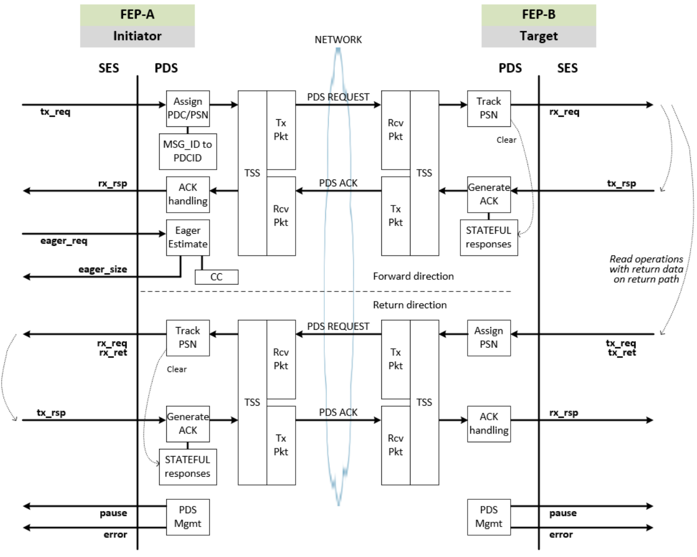
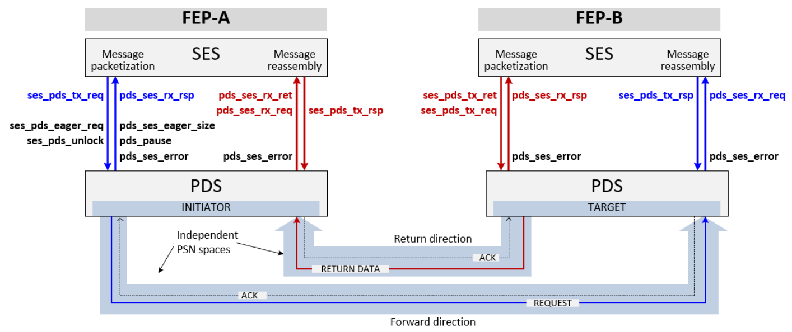

### 3.5.3 数据包传输服务（Packet Delivery Services）

数据包传输子层服务包括：

- 将由本地 Semantic Sublayer (SES) 发起的请求和响应传输到目标 SES：
  - PDS 处理 SES 数据包——而非消息。
    - SES 要求 PDS 按照指定的顺序性与可靠性传输一个数据包。
  - PDS 处理 SES 响应：
    - SES 为每一个已传输的数据包生成响应，通常为“成功”或“失败”，可选地包括少量状态（例如失败原因）和/或数据。
    - SES 响应可以携带数据（例如原子操作或读取数据）。
    - SES 指示哪些响应需要保证被传送。
    - SES 响应通过 PDS ACK 数据包进行承载。

- 从目标 SES 接收并转发请求和响应到本地 SES。

- 为从 SES 接收并发送至链路上的数据包，以及从链路接收并传递至 SES 的数据包 提供可靠性与顺序性保证：
  - PDS 提供可靠和不可靠的数据包传输服务。
  - PDS 提供有序和无序的数据包传输服务。

- 在网络端点（FEP）之间建立和拆除动态连接：
  - **PDS 向 SES 提供一个无连接接口**；在 FEP 之间按需使用动态建立的短暂连接（称为数据包传输上下文，PDC）。
  - PDS 还为幂等操作提供无连接的可靠传输；这使用一种单独的传输模式（RUDI，参见第 3.5.7.3 节），不建立任何连接。

PDS 定义了不同的传输模式，以提供多种顺序性与可靠性服务。每一个 UET profile 都定义了其可用的数据包传输模式与拥塞管理方案。UET profile 定义见 UET overview 章节。UET 的数据包传输模式定义在本节的 PDS 部分 —— 参见第 3.5.6 节。

UET 的 PDS 设计紧密配合 语义子层SES 和 拥塞管理子层CMS。SES 负责：
- 将消息分段为数据包，交由 PDS 进行传输；
- 将从 PDS 接收的数据包重新组装为消息；
- 为接收到的每一个请求数据包生成响应。

PDS 并不知道 SES 的事务类型。针对 read request 返回的数据称为“返回数据（return data）”。如第 3.5.12.1 节所述，它可通过 PDS ACK 或 PDS Request（在返回方向）承载。

CMS 服务包括：
- 监控遥测信号以检测网络与端点的拥塞；
- 在源和目的地之间传递拥塞状态；
- 生成信号以控制 PDS 连接的传输特性。传输特性称为发送控制（transmit controls），基于如下内容：
  - 某个连接或一组连接上可在途的数据量（即窗口大小和/或信用）。

- 支持多路径传输，结合拥塞感知的路径分配。

**UET 在语义子层将较大的读取请求拆分为多个读取请求数据包，其中单个读取请求数据包必须被限制为最多请求一个 MTU 的数据**。此操作由语义子层（SES）执行，详情参见 SES 第 3.4.4.2 节。

本规范提供了 PDS 与 SES 之间的逻辑接口，用于定义 PDS 的行为。PDS 与 SES 之间的实际接口由具体实现决定。

> **参考性文本：**  
> 实现时可选择合并 PDS 与 SES。

---

### 3.5.4 PDS-SES 逻辑接口（PDS-SES Logical Interface）

本节包含非规范性文本，描述了从逻辑角度出发的 SES-PDS 接口示例，用于说明接口间交换的信息。  
PDS 与 SES 之间的接口由实现决定。表 3-27 总结了一个使用 C 函数签名的 PDS-SES 接口示例。图 3-40 以图形方式描绘了该示例接口。
本示例提供了理解整体架构的框架，但使用了部分将在后续章节介绍的术语。

以下定义了在 SES 与 PDS 之间传递的逻辑结构和命令，仅用于说明概念，而非规定实现要求。接口包含源 FEP 字段，以支持多个 FEP；对于单个 FEP 实例，未必在每次调用时传递源 FEP 字段。

```c
struct uet_ep *src_fep           // 指向源地址等信息的结构体
struct uet_ep *dst_fep           // 指向目的地址等信息的结构体
uint32_t jobid                   // SES 传递的作业 ID
uint32_t tss_context             // 传输安全子层上下文（如 SDI），用于限制 PDC 上的数据包属于同一 SDI
uint8_t mode                     // 传输模式 = {RUD, ROD, RUDI, UUD}
uint16_t rod_context             // 标识一个 ROD 发送队列，用于保持队列中数据包在同一 PDC 上
boolean rsv_pdc                  // 1 = 使用保留的 PDC，0 = 不使用保留 PDC
uint16_t rsv_pdc_context         // 用于保持数据包在同一保留 PDC 中
uint16_t rsv_ccc_context         // 用于保持数据包在同一保留 CCC 中
uint16_t tx_pkt_handle           // SES 在源端分配的数据包句柄
uint16_t msg_id                  // SES 在源端分配的消息标识符
void *pkt                        // 指向数据包的指针
uint16_t pkt_len                 // 数据包长度（字节）
void *rsp                        // 指向响应的指针
uint16_t rsp_len                 // 响应长度（字节）
uint8_t tc                       // 流量等级（traffic class）
unit8_t next_hdr                 // 由 SES 控制，用于确定封装的 UET 负载中的头部类型
bool som                         // TRUE => 消息起始
bool eom                         // TRUE => 消息结束
bool lock_pdc                    // TRUE => 在 SES 表示解除锁定前，不关闭该 PDC（需另一个函数解锁）
bool return_data                 // TRUE => 数据包必须使用 orig_pdcid 所标识的 PDC（用于读取响应）
uint16_t orig_pdcid              // 正向读取请求中的 PDCID（本地标识具体的 PDC）
bool orig_psn_val                // TRUE => 在 PDS Request 头中包含原始 PSN 字段
uint32_t orig_psn                // 来自读取请求或 Def Send 的正向 PSN
bool gtd_del                     // TRUE => SES 响应需保证传输
bool ses_nack                    // SES 指示发送 PDS NACK
uint16_t eager_id                // SES 的 eager 估算请求标识符
uint32_t eager_size              // eager 数据的大小（字节）
uint16_t rx_pkt_handle           // PDS 在目的端分配的数据包句柄
bool pdc_pause                   // TRUE => SES 停止向 PDS 发送 RUD/ROD 数据包
bool rudi_pause                  // TRUE => SES 停止向 PDS 发送 RUDI 数据包
enum pds_error                   // 表示 PDC 重置原因的枚举
```

上下文用于将数据包分组或隔离到 PDC 或 CCC 中。上下文由 SES 分配，并由 PDS 在将数据包分配给 PDC 和/或 CCC 时使用。

#### 表 3-26 - 数据包上下文（Packet Contexts）

| 上下文（Context）        | 用法（Usage） |
|--------------------------|----------------|
| `tss_context`            | 用于将 PDC 上的所有数据包限制为同一个 SDI；也就是说，一个 PDC 上的所有数据包必须具有相同的 `tss_context`。<br>SDI，即安全域标识符（Secure Domain Identifier），在 TSS 第 3.7.4 节中定义。 |
| `rod_context`            | 用于将具有相同 `rod_context` 的所有数据包保持在同一个 PDC 中。多个 `rod_context` 可映射到同一个 PDC。如果与安全性一起使用，则包含 SDI，忽略 `tss_context`。 |
| `rsv_pdc_context`        | 用于将一个 PDC 上的所有数据包限制为一个保留组；也就是说，一个 PDC 上的所有数据包必须具有相同的 `rsv_pdc_context`。如果与安全性一起使用，则包含 SDI，忽略 `tss_context`。 |
| `rsv_ccc_context`        | 用于控制哪些 PDC 共享一个 CCC。如果该值非零，则用于将 PDC 关联到一个 CCC。此字段用于支持一个保留服务，它可能希望为多个 PDC（例如多个 `rsv_pdc_context`）设置单独或共享的 CCC。`tss_context` 对于 CCC 无关紧要。 |



---

#### 表 3-27 - 基于函数的 PDS-SES 接口示例摘要

| 函数名（Function Name） | 方向（Direction） | 描述与参数（Description and Parameters） |
|--------------------------|------------------|--------------------------------------------|
| `ses_pds_tx_req()` | SES → PDS（发起方） |**SES 请求 PDS 发送**<br>`src_fep`, `dst_fep`, `jobid`, `mode`, `rod_context`, `next_hdr`, `tc`, `som`, `eom`, `lock_pdc`, `tx_pkt_handle`, `pkt`, `pkt_len`, `msg_id`, `tss_context`, `rsv_pdc`, `rsv_pdc_context`, `rsv_ccc_context`<br>- `msg_id` 用于将同一消息的所有数据包保留在同一个 PDC 中，例如：PDS 维护从 `som` 到 `eom` 的 `msg_id` 到 `pdcid` 的映射，或者如果 `lock_pdc=TRUE` 则更长时间。<br>- `lock_pdc` 防止 PDS 拆除 PDC，更多信息参见 `ses_pds_unlock()` 的描述。<br>- `rsv_pdc` 允许为专用服务保留多个 PDC；使用 `rsv_pdc_context` 和 `rsv_ccc_context` 可以在不管理 PDCID 的情况下将一组数据包放在同一 PDC 和 CCC 上。 |
| `pds_ses_rx_req()` | PDS → SES（目标） | **PDS 接收 SES 请求**<br>`rx_pkt_handle`, `pkt`, `pkt_len`, `next_hdr`, `orig_pdcid`, `orig_psn`<br>- `orig_psn` 是接收数据包的 PSN，SES 在某些读响应中使用；仅对前向方向接收的数据包有效。 |
| `ses_pds_tx_ret()` | SES → PDS（目标） | **SES 为 PDS 发送返回数据**<br>`src_fep`, `dst_fep`, `jobid`, `mode`, `next_hdr`, `tc`, `som`, `eom`, `tx_pkt_handle`, `pkt`, `pkt_len`, `msg_id`, `return_data`, `orig_pdcid`, `rsv_pdc`, `rsv_pdc_context`<br>- 当 `return_data=TRUE` 时，此数据包为读取响应，必须使用与读取请求相同的 PDC（`orig_pdcid`）。<br>- 实现可将该功能整合入 `ses_pds_tx_req()` 中。 |
| `pds_ses_rx_ret()` | PDS → SES（发起方） | **PDS 接收 SES 返回数据**<br>`rx_pkt_handle`, `pkt`, `pkt_len`<br>- 实现可将该功能整合入 `pds_ses_rx_req()` 中。 |
| `ses_pds_tx_rsp()` | SES → PDS | **SES 响应的 PDS 发送**<br>`src_fep`, `dst_fep`, `rx_pkt_handle`, `gtd_del`, `ses_nack`, `rsp`, `rsp_len` |
| `pds_ses_rx_rsp()` | PDS → SES | **PDS 接收 SES 响应**<br>`tx_pkt_handle`, `rsp`, `rsp_len` |
| `ses_pds_unlock()` | SES → PDS | **SES 解锁 PDC，允许 PDC 被拆除**<br>`msg_id`<br>- `ses_pds_tx_req()` 函数的 `lock_pdc` 参数表示在读取请求的返回数据已在该 PDC 上返回之前，PDC 不得关闭。<br>- PDC 维护一个计数器，每次以 `lock_pdc=TRUE` 调用 `ses_pds_tx_req()` 时加一，调用 `ses_pds_unlock()` 函数时减一。如果计数器不为零，PDC 不可关闭。 |
| `ses_pds_eager_req()` | SES → PDS | **SES 请求发起方估算适当的 eager 大小**<br>`src_fep`, `dst_fep`, `mode`, `tc`, `eager_id`<br>- eager 数据仅用于 rendezvous。<br>- PDS 的可靠性决定是否存在与给定 `dst_fep`, `tc`, `mode` 对应的 CCC；如果存在，CMS 计算该 CCC 的 eager 大小，否则返回默认 eager 值。 |
| `pds_ses_eager_size()` | PDS → SES | **PDS 返回发起方估算的 eager 大小（对 `ses_pds_eager_req` 的返回）**<br>`eager_id`, `eager_size`<br>- 估算 eager 大小的值。 |
| `pds_pause()` | PDS → SES | **PDS 指示 SES 暂时资源不可用**<br>`pdc_pause`, `rudi_pause`<br>- 当 `pdc_pause=TRUE` 时，不再向 PDS 传递 RUD 或 ROD 请求数据包。<br>- 当 `rudi_pause=TRUE` 时，不再传递 RUDI 数据包。<br>- PDS 可再次调用该函数以恢复（设置为 FALSE）。<br>- 实现 **可以** 允许在 `pds_pause=TRUE` 或 `rudi_pause=TRUE` 时继续发送响应。 |
| `pds_ses_error()` | PDS → SES | **PDS 不可恢复错误**<br>`pds_error`, `tx_pkt_handle` 或 `rx_pkt_handle`<br>- 如果一个 PDC 发生不可恢复错误，PDS 将为与该错误事件相关的每一个未确认的 SES 请求数据包返回一个 `pds_ses_error` —— 如果 PDS 整体因错误被拆除，则可能涉及所有未完成的数据包。 |

---

发起方和目标的 PDC 处理在结构上是对称的：SES 发起发送请求并接收对应的 SES 响应。在目标侧，SES 请求仅限于对读取请求的响应（即返回数据）。

只有发起方可以发出 eager 窗口大小的查询，因为只有发起方可以发送 Send 消息。

图 3-41 展示了这些示例 API 在发起方和目标之间如何交互。图中较粗的箭头（Request/ACK 和 Return Data/ACK）表示前向与返回方向中使用的独立 PSN 空间。PSN 在 3.5.8 节中描述。

