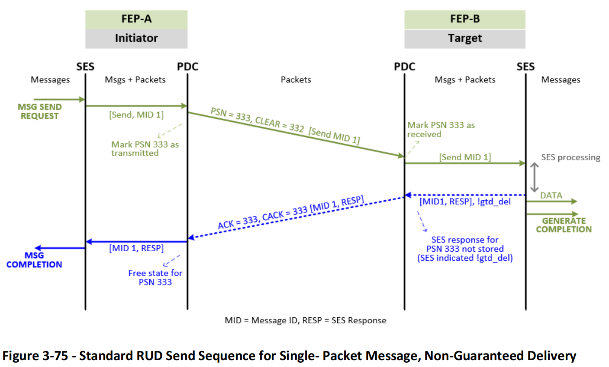
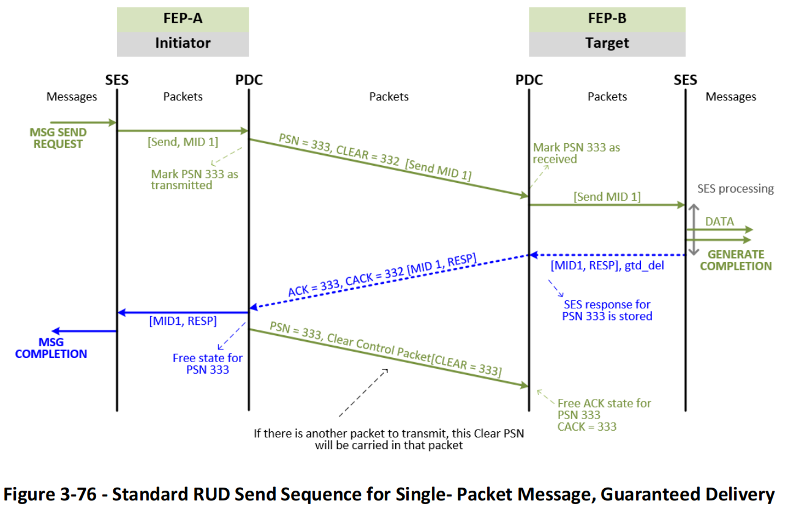
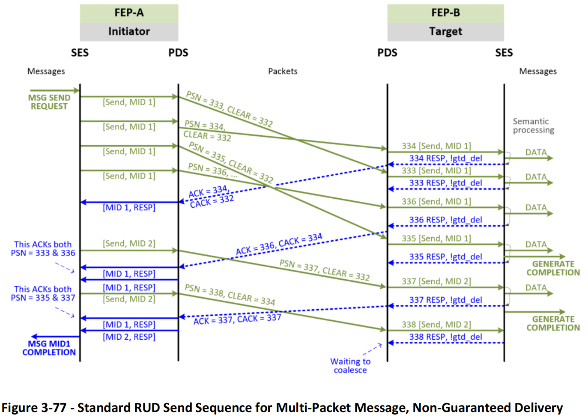
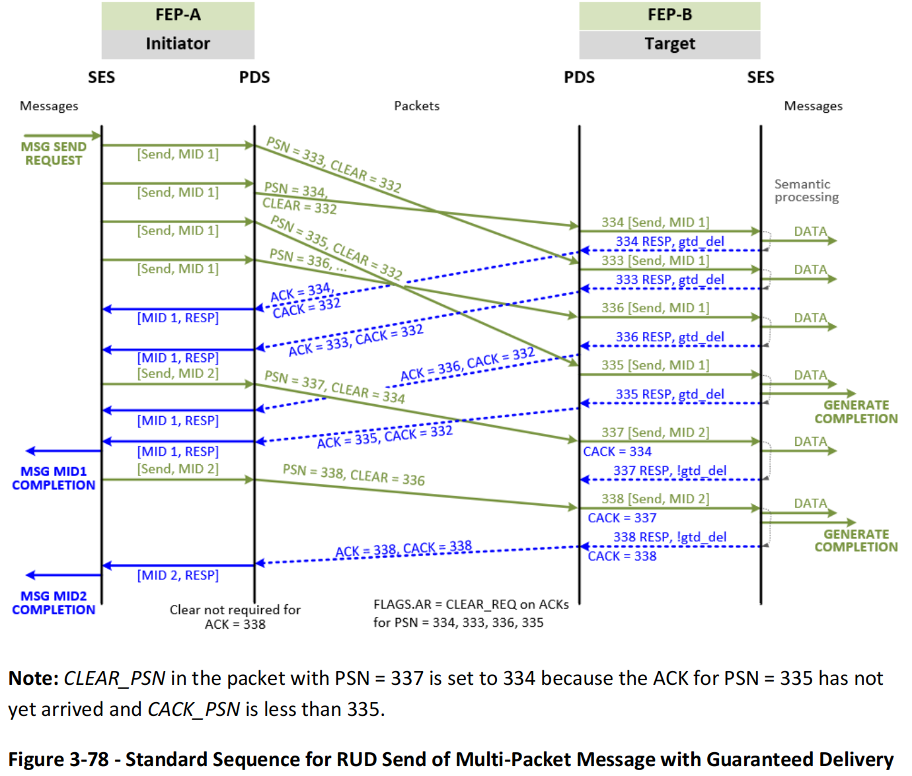
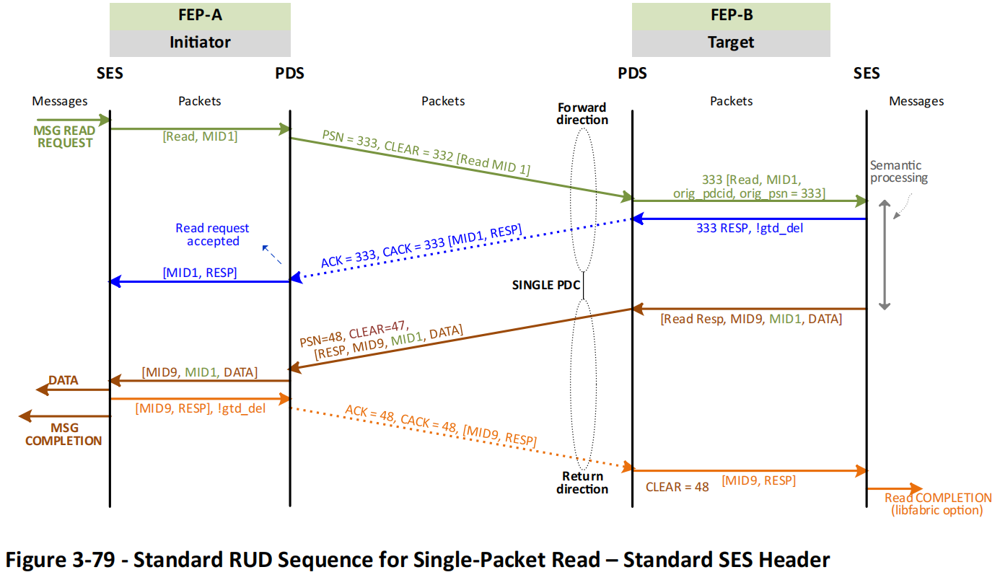
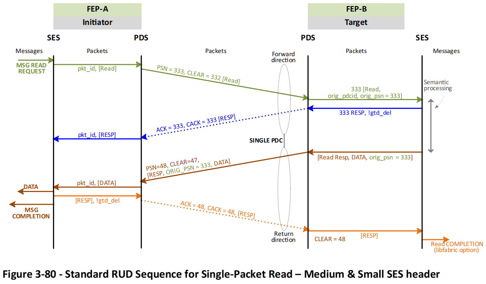
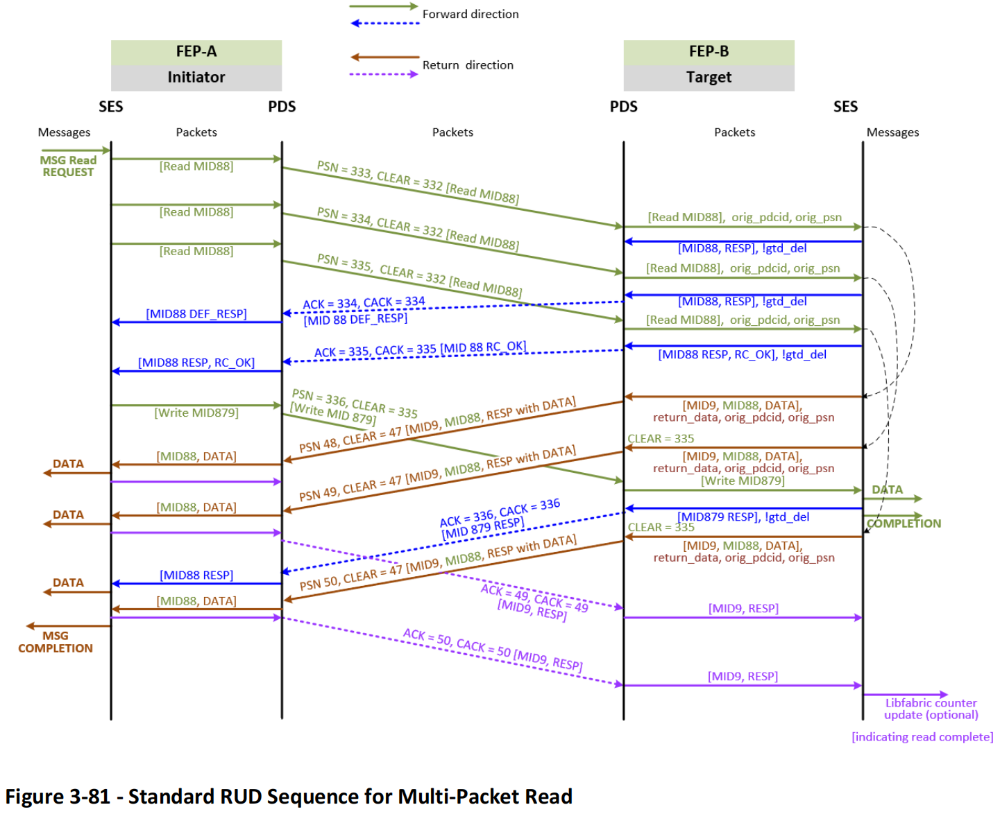
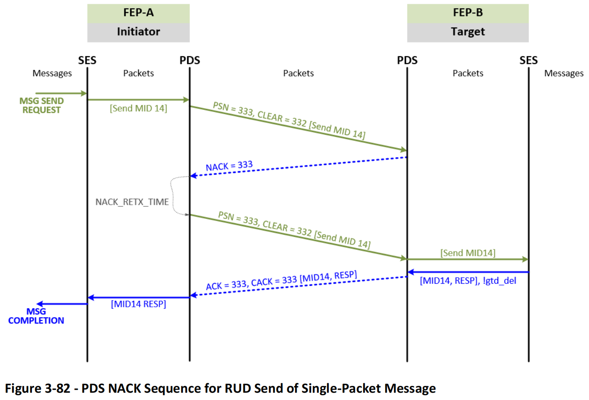
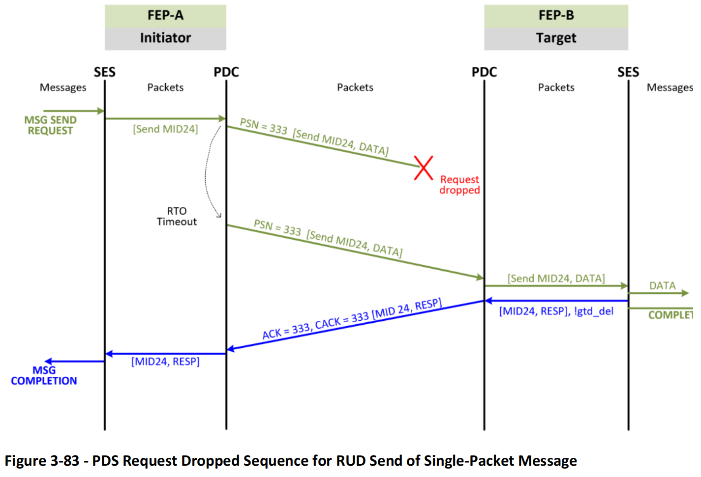
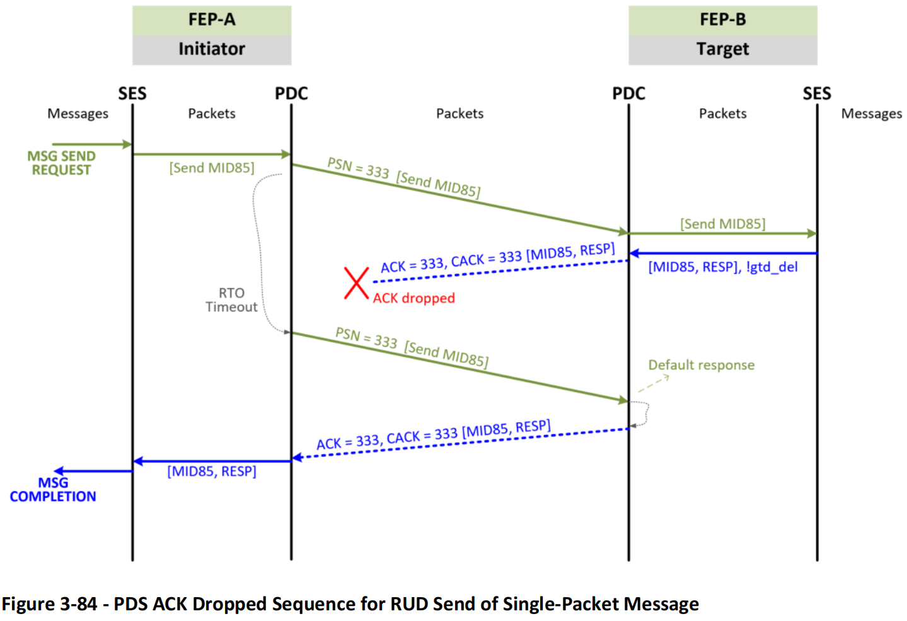

### 3.5.20 可靠无序传输（Reliable Unordered Delivery）

RUD PDC 是在单个发起 FEP 与单个目标 FEP 之间建立的可靠 PDC，确保数据包仅被传送一次。PDC 是临时的，按需建立和关闭。多个 PID 和/或发送队列的数据包可以共享一个 PDC。一个消息的所有数据包使用同一个 PDC。

#### 3.5.20.1 RUD 服务

应认识到，所有 SES 请求（发送、写、读、原子操作等）对于 PDS 来说在本质上是相同的。

1. RUD 必须按照源 SES 的指示发送 PDS 请求数据包，并在最大重传次数 `Max_RTO_Retx_Cnt` 内尝试重传以确保交付。
2. RUD 必须确保 PDS 请求数据包仅被目的 SES 接收一次。
3. RUD 必须在目的地生成携带 SES 响应的 ACK 数据包。
   - a. SES 可向 PDS 指示每个 SES 响应是否要求保证交付；
   - b. 若 SES 响应要求保证交付（不包括读响应中 ACK 携带的数据），PDS 必须存储该响应以便在接收到有效重复请求时重传 ACK（即在 ACK 窗口内，见第 3.5.12.6 节）；
   - c. 若 SES 响应未要求保证交付，且接收到有效重复请求，PDS 必须构造默认的 SES 响应以重传 ACK；
   - d. 对于保证交付的 SES 响应，PDS 必须在收到明确清除指示后，才可释放该响应。
4. 源端 PDS 必须接收并处理 ACK 数据包，并将 SES 响应传递给 SES。
5. 所有 PDS 请求中，源端必须发送 CLEAR_PSN，通过正确设置 `pds.clear_psn_offset` 和 `pds.psn` 字段完成。该 CLEAR_PSN 的计算值不会显式地在请求中发送。
6. 若收到清除请求 CP，PDS 必须发送 CLEAR_PSN——或如步骤 5 所述包含在请求中，或在 Clear Command CP 中作为 `pds.payload` 发送。
7. PDS 必须接收并处理 CLEAR_PSN。
   - a. 若对应 PSN 被清除，PDS 必须释放任何已存储的 SES 响应。
8. PDS 必须将同一消息的所有读响应沿同一方向发送。
   - a. 若消息大于 `PDS Max_ACK_Data_Size`，即使最后一个数据包的数据小于该值，所有响应也使用返回方向。

SES 读序列依据 `Max_ACK_Data_Size` 配置有所不同，详见第 3.5.12.1 节。

#### 3.5.20.2 标准序列

可靠无序传输（RUD）序列以梯形图形式呈现。本节描述在 PDC 建立后 RUD 的正常序列（即 PDS 成功场景）。

##### 3.5.20.2.1 单数据包发送序列 —— 非保证交付

发送和写操作在尽力而为与无损网络中的序列相同。图 3-75 展示了 SES 响应为非保证交付的单数据包消息的标准 RUD 发送序列：

1. PDC 处于空闲状态，所有前序数据包成功交付，PSN = ACK_PSN = CLEAR_PSN = 332。
   - a. 若当前 PSN 无保证交付，CLEAR_PSN 自动递增。
2. 发起端 SES 向 PDS 提交一个要发送的数据包。
3. 发起端 PDS 在 PDC 上发送该包，设置 PSN = 333，并标记其已发送。
4. 目标端 PDS 接收该包，标记 PSN = 333 已接收，并交付给 SES。
5. 目标端 SES 向 PDS 返回语义响应，未标示保证交付。
6. 目标端 PDS 发送 PSN = 333 的 ACK 包，附带 SES 响应。
   - a. ACK 中 `pds.flags.req != REQ_CLEAR`，因为不需要清除；
   - b. 因响应非保证交付，CACK_PSN 递增；
   - c. 除了 PSN 跟踪状态（如 bitmap/PSN）外，不需额外状态存储。
7. 发起端 PDS 接收 ACK，传给 SES，并释放 PSN = 333 的状态。

图 3-75 中的标准 RUD 发送序列也适用于非获取型原子操作。在该非保证交付场景中，无需清除。通常，只要所有较低的 PSN 都处于清除状态（通过收到 CLEAR_PSN 或因 SES 响应无需清除），PSN 状态即可释放。

##### 3.5.20.2.2 单数据包发送序列 —— 保证交付

在尽力而为与无损网络中，PDS 对于发送和写操作的序列相同。图 3-76 展示了带有 SES 保证交付响应的单数据包消息的标准 RUD 发送序列：

1. PDC 处于空闲状态，所有前序数据包成功交付，PSN = ACK_PSN = CLEAR_PSN = 332。
2. 发起端 SES 向 PDS 提交一个要发送的数据包。
3. 发起端 PDS 在 PDC 上发送该包，设置 PSN = 333，并标记其已发送。
4. 目标端 PDS 接收该包，标记 PSN = 333 已接收，并交付给 SES。
5. 目标端 SES 向 PDS 提供带有保证交付标记（`gtd_del`）的语义响应。
6. 目标端 PDS 发送 PSN = 333 的 ACK 包，附带 SES 响应。
   - a. ACK 中 `pds.flags.req = REQ_CLEAR`，因为需要清除；
   - b. 由于响应为保证交付，CACK_PSN 不递增；
   - c. SES 响应在目标端被存储。
7. 发起端 PDS 接收 ACK，传给 SES，并释放 PSN = 333 的状态。
8. 发起端 PDS 向目标发送 CLEAR_PSN = 333，可通过以下任一方式：
   - a. 将 CLEAR_PSN 包含在下一条 PDS 请求中；
   - b. 若无可发送的请求包，则使用 Clear Command CP；何时生成 Clear CP 详见第 3.5.16.3 节。
9. 目标端 PDS 接收到 CLEAR_PSN 后，释放 PSN = 333 的 SES 响应状态。
   - a. CACK_PSN 在收到 CLEAR_PSN 后递增至 333。

#### 3.5.20.2.3 多数据包发送序列 —— 非保证交付

在尽力而为与无损网络中，发送与写入操作的序列是相同的。图 3-77 展示了多数据包消息的标准 RUD 发送序列，执行如下：

1. 多数据包消息的 RUD 发送序列与单数据包消息相同：
   - a. 单数据包序列对多数据包消息中的每个包重复执行；
   - b. 目的端可能收到乱序到达的数据包；
   - c. ACK 可能是累计的——图中展示每两个数据包生成一个 ACK；然而，当使用累计 ACK 时，ACK 生成事件可能不同，详见第 3.5.12.2 节。
2. PDC 处于空闲状态，所有前序数据包已成功交付，PSN = ACK_PSN = CLEAR_PSN = 332。
3. 在发起端，每发送一个数据包，PSN 递增；CLEAR_PSN 随着来自目标端的 CACK_PSN 递增。
   - a. 由于这些 SES 响应均为非保证交付，CACK_PSN 会随着生成的 ACK 填补 SACK 位图而增加，而不是依赖于接收到 CLEAR_PSN。
4. 一个 ACK 可确认多个数据包；PDS 可为 SES 生成多个响应消息 —— 被 ACK 的 PSN 可能不是连续的。

#### 3.5.20.2.4 多数据包发送序列 —— 保证交付

图 3-78 展示了带有 SES 保证交付响应的多数据包消息的 RUD 发送序列。该示例中，MID = 1 的四个数据包全部标记为保证交付。

如果发生错误事件，SES 可将其中一个数据包标记为保证交付，而其他包无需保证交付。当消息中任何一个数据包出错时，整个消息被视为出错，因此无需所有响应都具备保证交付。

所有具有保证交付的 PSN 都具有独立的 ACK（即每个 PSN 一条 ACK）；而 PSN = 337 和 338 被合并在一个 ACK 中。由于 CLEAR = 336 早于 ACK 338 到达，且 337 和 338 的响应为非保证交付，CACK_PSN 同样推进至 338。此时 ACK_PSN = CACK_PSN，因此无需额外的清除操作。

#### 3.5.20.2.5 单数据包读取序列 —— SES 标准头部

如第 3.4.2 节中所述，SES 报文头有三种类型：标准（`UET_HDR_REQUEST_STD`）、中等（`UET_HDR_REQUEST_MEDIUM`）和小型（`UET_HDR_REQUEST_SMALL`）。仅标准头部包含 `ses.message_id` 字段，这导致读取过程存在差异。

本节描述标准头的读取序列；中等与小型头的序列见第 3.5.20.2.6。对于 PDS 来说，无论 SES 报文头类型如何，处理流程是一样的。

图 3-79 展示了在尽力而为网络中，使用 SES 标准头的单数据包读取操作的标准 RUD 序列。该读取返回的数据大于 `Max_ACK_Data_Size`，因此返回方向用于发送返回数据。

该序列如下：

1. PDC 处于空闲状态，所有前序数据包已成功交付，PSN = ACK_PSN = CLEAR_PSN = 332。
2. SES 从上层接收读取请求，生成 MID = 1 的 SES 请求。
   - a. 使用标准 SES 请求头时，SES 会分配唯一的消息 ID，以便 FEP-A 能将读取响应与对应的请求关联：
     - i. SES 的中型和小型头不包含消息 ID，详见第 3.5.20.2.6；
     - ii. 实现应确保消息 ID 在所有 PDC 中全局唯一，以便发起端能在返回方向中快速定位响应；
     - iii. 消息 ID 在每个 PDC 内唯一。
3. 发起端将 SES 读取请求作为 PDS 请求发送至目标端，PSN = 333。
4. 目标端发送 PSN = 333 的 ACK：
   - a. ACK 中包含 SES 响应，本示例中为 `RC_OK`，表示请求被接受但数据未包含在 ACK 中（非保证交付）；
   - b. 发起端收到该 ACK 后，其 SES 读取事务处理完成。
5. 目标 SES 执行读取操作，生成请求，指示 PDS 向 FEP-A 发送一个返回数据包：
   - a. 该包带有 `SES UET_HDR_RESPONSE_DATA` 报文头，包含数据和 FEP-A 分配的原始 MID（本例中为 1）；
   - b. 目标 SES 可选择分配自己的消息 ID，并通过以下方式跟踪读取事务：
     - i. 作为一个整体事务，使用本地分配的 MID（本例中为 9），在所有返回数据包发送并被 ACK 后触发如 libfabric 计数器更新（可选功能）；
     - ii. 每个数据包独立处理，不使用计数器，是否使用目标自分配的消息 ID 取决于实现。
6. 目标使用 PSN = 48 发送 PDS 请求：
   - a. 数据包包含请求的读取数据；
   - b. 使用与原始请求到达时相同 PDC 的返回方向，详见第 3.5.8.1 节；
   - c. SES 头中携带 `ses.read_request_message_id`（原始消息 ID），并在目标已分配时包含 `ses.response_message_id`，详见第 3.4.1.14 节。
     - i. 示例中目标分配的 MID = 9 会在未合并的 ACK 中回显。
7. 发起端收到 PSN = 48 的数据包后，发送 ACK：
   - a. 返回数据交付给发起端 SES。
     - i. 示例中，发起端实现可维护一个消息 ID 的包计数器；当收到期望数量的数据包时，SES 认为消息完成；当所有包在目标处被 ACK 后，整个事务完成；
   - b. 与其他事务相同，该读取响应事务成功时，其 ACK 无需清除操作。

图 3-79 展示了 SES 如何回显原始 MID = 1，帮助发起端将返回数据与读取请求关联。

#### 3.5.20.2.6 单数据包读取序列 —— SES 中型与小型头部

当 SES 使用中型（`UET_HDR_REQUEST_MEDIUM`）或小型（`UET_HDR_REQUEST_SMALL`）报文头时，报文中不包含 `ses.message_id` 字段，这会导致读取过程有所不同。为将响应与请求对应，SES 响应头中携带请求的 PSN（`ses.original_request_psn` 字段）来替代消息 ID。这些序列与第 3.5.20.2.5 节中的示例类似。

图 3-80 展示了在尽力而为网络中，使用 SES 中型或小型头部进行单数据包读取的标准 RUD 序列。本示例中返回数据大于 `Max_ACK_Data_Size`，因此使用返回方向发送数据。

序列流程如下：

1. PDC 处于空闲状态，所有前序数据包成功传输，PSN = ACK_PSN = CLEAR_PSN = 332。
2. SES 接收读取请求并生成不含消息 ID 的 SES 请求。
3. 发起端将读取请求作为 PDS 请求发送至目标端，PSN = 333。
4. 目标端发送 PSN = 333 的 ACK。
   - a. ACK 中包含 SES 响应。
5. 目标 SES 处理读取请求，并向 PDS 生成响应发送请求。
   - a. 响应使用 `UET_HDR_RESPONSE_DATA` 报文头，包含数据与原始 PSN（本例为 333），以 `ses.original_request_psn` 字段关联数据与请求（因头部无 `message_id`）。
6. 目标使用 PSN = 48 发送 PDS 请求。
   - a. 包含读取数据，并使用与请求相同的 PDC 返回方向，见 3.5.8.1 节；
   - b. SES 响应头中携带原始请求 PSN（本例为 333）。
7. 发起端收到 PSN = 48 后，发送 ACK。
   - a. 读取响应流程与其他事务相同；ACK 成功时无需清除操作。

---

#### 3.5.20.2.7 单包读取序列优化

对于数据量小于等于 `Max_ACK_Data_Size` 的读取响应，SES 可直接将读取响应数据与 ACK 一起返回。这种方式对小型读取及获取型原子操作非常高效。该序列与第 3.5.20.2.2 节中保证交付的单包发送序列相同。

---

#### 3.5.20.2.8 多数据包读取序列

当应用请求读取数据超过一个 MTU 时，会触发多包读取，处理方式为对每个数据包重复一次单包读取流程。

图 3-81 展示了一个多包读取的 RUD 序列示例：

1. PDC 处于空闲状态，所有前序数据包成功传输，PSN = ACK_PSN = CLEAR_PSN = 332。
2. FEP-A 的 SES 向 PDS 发送三个包：两个为 1 MTU 读取，一个为小读取（小于 `Max_ACK_Data_Size`）。
   - a. 三个包属于一个 SES 消息，均使用相同的消息 ID（=88）。
3. FEP-B 为前两个到达的包生成 ACK。示例中使用累计 ACK（即无 PSN = 333 的 ACK，FEP-A 通过 `CACK_PSN = 334` 确认 PSN = 333 已被确认）。
   - a. `pds.cack_psn = 334`，`pds.ack_psn_offset = 0`；
   - b. 该 ACK 非保证交付，使用默认 SES 响应。
4. FEP-B 为第三个包生成第二个 ACK，`pds.psn = 335`。
   - a. SES 响应为 `RC_OK`，表示请求被接受，返回数据将经返回方向发送。该 ACK 也非保证交付，CACK_PSN 递增；
   - b. `pds.cack_psn = 335`，`pds.ack_psn_offset = 0`。
5. FEP-A 发出新的写请求消息，使用不同的消息 ID（=879）。
   - a. 该请求在 `pds.clear_psn_offset = -1` 和 `pds.psn = 336` 中编码 `CLEAR_PSN = 335`。
6. FEP-B SES 为前两个读取请求生成响应并传递至 PDS。
   - a. 通过 PSN = 48 和 49 的 PDS 请求包，在返回方向发送。
7. FEP-A PDS 对两个 SES 响应发送累计 ACK：
   - a. `pds.cack_psn = 49`，`pds.ack_psn_offset = 0`。
8. FEP-B PDS 使用 `pds.cack_psn = 336`，`pds.ack_psn_offset = 0` 确认写请求消息 879。
9. FEP-B SES 为第三个读取包生成返回数据，PDS 使用 `pds.psn = 50`，`pds.clear_psn_offset = -3` 发送。
   - a. 由于 ACK 48 和 49 尚未抵达 FEP-B，`clear_psn_offset = -3`。
10. FEP-A PDS 接收 `pds.psn = 50` 的数据包，发送包含 PSN 48–50 清除指示的 ACK：
    - a. `pds.cack_psn = 50`，`pds.ack_psn_offset = 0`。

---

### 3.5.20.3 否认确认（NACK）、丢包与重传

本节定义了 RUD 在出现丢包及其他触发 PDS 重传情形下的序列。NACK 可由 PDS 或 SES 产生。此节仅涵盖 PDS NACK；SES NACK 不可见于 PDS，但作为“保证交付”的 SES 响应存在；SES 的重试会以新的请求形式展现给 PDS。

#### 3.5.20.3.1 单包 PDS NACK 序列

图 3-82 展示了单包消息的 RUD 发送中 PDS NACK 序列：

1. PDC 处于空闲状态，PSN = ACK_PSN = CLEAR_PSN = 332。
2. FEP-A 生成 MID = 14 的消息，PDS 发送 PSN = 333。
3. 目标 PDS 接收到 PSN = 333 的 PDS 请求时，发生“包缓冲区溢出”。
4. FEP-B 的 PDS 生成并发送 NACK 333 包至 FEP-A。
   - a. FEP-B 丢弃该 PDS 请求。
5. FEP-A 的 PDS 负责重传 PSN = 333。
6. 根据 `pds.nack_code`，FEP-A 等待配置时间后重传：
   - a. 若超过 `Max_NACK_Retx_Cnt`，PDS 触发错误并以错误完成事务；
   - b. 若 NACK 丢失，FEP-A 的 PDS 仍需在 RTO 超时后进行重传，最多重试 `Max_RTO_Retx_Cnt` 次。

多包消息和读取操作的 PDS NACK 序列与单包消息相同。

#### 3.5.20.3.2 丢包与 ACK 丢失下的 NACK 序列

当以下情况发生时，发起端 PDS 需重试传输：

- 发起端发送的 PDS 请求丢失，未到达目的端；
- 目标端发送的 ACK 丢失，未返回源端；
  - PDS 依据 `CACK_PSN` 判断 ACK 状态，包括成功 ACK 和保证交付 ACK（可由 `pds.sack_bitmap` 判断数据包已到达但 `CACK_PSN` 尚未更新）。

图 3-83 展示了单包消息中 PDS 请求丢失时的处理流程：源端负责超时重传。

图 3-84 展示了 ACK 丢失时的处理流程，步骤如下：

1. PDC 空闲，PSN = ACK_PSN = CLEAR_PSN = 332。
2. FEP-A 发送 PSN = 333 的请求。
3. FEP-B 接收请求，标记为已接收，生成 ACK = 333。
4. 示例中，该 ACK 在网络中丢失。
5. FEP-A 超时后重传 PSN = 333。
   - a. 除超时外，也可用 NACK、SACK 位图等方法检测丢包。
6. FEP-B 处理重传包：
   - a. 检查 PSN 是否超出有效范围（MP_RANGE）；若是，则丢弃；
   - b. 若 PSN 尚未标记接收，则接受并传递至 SES —— 本例中已接收；
     - i. 设置 `pds.flags.retx` 表明为重传，触发 ACK；但此标志不表明之前数据包是否成功抵达；
   - c. PSN = 333 属于期望范围，已标记接收：
     - i. 若存在保证交付的 SES 响应：
       1. 使用已存储响应重新发送 ACK；
       2. 等待清除前不释放响应；
     - ii. 若不存在保证交付响应：
       1. 重新发送 ACK，携带默认响应；见 3.5.17。

