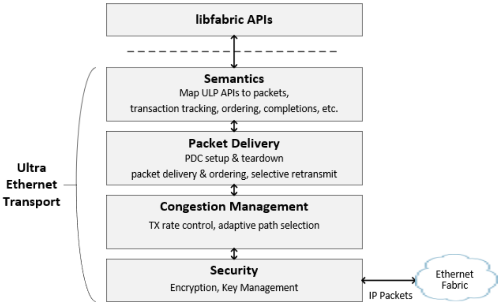

# UEC Specification Notes

本仓库存放本人在学习 UEC Specification 过程中的笔记，内容可能包含中文和英文混合。方便日后复习和查阅。

笔记文件列表：
- [Abbreviations](Notes/Abbreviation.md)
- [Terms](Notes/Terms.md)

- Packet delivery Sublayer (PDS)

    数据包传输子层是超以太网传输（UET）协议中负责通过 IP/Ethernet 网络传输数据包的部分。该 packet dilivery 服务提供可靠性和顺序控制功能。PDS 作为 UET 中的一个子层，位于语义子层（SES）和传输安全子层（TSS）之间，如图3-38所示。

    

  - [PDS术语 & 解释](Notes/PDS-Terms.md)
  - 
- 
- Congestion management Sublayer (CMS)
  - [UET-CC (NSCC)](Notes/UET-CC.md)  
  - [Multipath Path Selection & Switch configuration](Notes/multipath.md)

---

Discussions and Contributions are very welcome!
