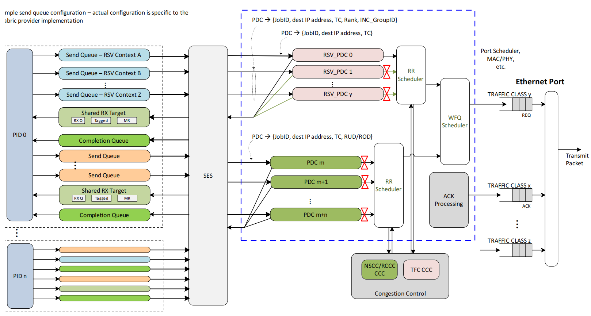

# UEC Specification Notes

本仓库存放本人在学习 UEC Specification 过程中的笔记，内容可能包含中文和英文混合。方便日后复习和查阅。

Discussions and Contributions are very welcome!

---

## 笔记文件列表：

## Chapter 1 Introduction
### [Abbreviations](Notes/Abbreviation.md)
### [Terms](Notes/Terms.md)

## Section 3.5 Packet delivery Sublayer (PDS)

数据包传输子层是超以太网传输（UET）协议中负责通过 IP/Ethernet 网络传输数据包的部分。该 packet dilivery 服务提供可靠性和顺序控制功能。PDS 作为 UET 中的一个子层，位于语义子层（SES）和传输安全子层（TSS）之间，如图3-38所示。

### [PDS术语 & 解释](Notes/PDS-Terms.md)
### [Packet Delivery Services Overview](Notes/PDS.md)
### (TODO) 3.5.5 PDS Configuration Parameters
### [3.5.6 Reliability and Ordering](Notes/Reliability.md)
### 3.5.7 Packet Delivery Modes Overview
### 3.5.8 Packet Delivery Contexts (PDC)
### 3.5.9 PDS Event State Machine
### 3.5.10 Header Formats
### 3.5.11 Header Fields
### 3.5.12 Requests and Acknowledgements
### 3.5.13 Default SES Responses
### 3.5.14 Transmit Scheduling

PDS应避免在服务其他PDCs的同时，长时间饥饿共享同一流量类别的PDCs。PDS可能会采用分层调度策略，即某些PDCs在同一流量类别中被赋予更高的优先级。这适用于PDS请求、确认和确认信息。较高的优先级应通过加权公平队列（WFQ）而非严格优先级（SP）来实现，因为SP调度可能导致阻塞或饥饿。图3-69展示了一个与UET高度一致的潜在传输调度架构。

### 3.5.15 [Loss Detection and Recovery](Notes/LossDetection.md)

### 3.5.16 Control Packet (CP)

### 3.5.17 Semantic Responses

### 3.5.19 Sequence Diagrams

### 3.5.20 Reliable Unordered Delivery

### 3.5.21 Reliable Ordered Delivery

### 3.5.22 RUDI Sequence Diagrams

### 3.5.23 Error Model

### 3.5.24 Full Header Format

### 3.5.25 UET CRC

---

## Section 3.6 Congestion management Sublayer (CMS)

UET 定义了一种端到端拥塞管理解决方案，UET-CC（UET Congestion Control），用于在尽力而为（有时称为“有损”）的以太网网络中处理数据包缓冲区拥塞。目标是实现高网络效率、减少数据包丢失、最小化延迟（包括尾部延迟），并确保在竞争流之间实现合理的公平性。

目标网络（称为后端网络）主要承载高性能计算（HPC）和人工智能训练和/或推理工作负载。为了避免不公平，建议所有与 UET-CC 流量处于同一流量等级的流量均运行 UET 拥塞控制。UET-CC 并不适用于广域网流量，因为它假设一个低延迟的控制回路：UET-CC 针对预期的基础往返时延（RTT）在 1 微秒到 20 微秒之间。建议网络结构控制流量（例如运行于 TCP 上的 BGP）或其他不使用 UET-CC 的流量应运行于单独的流量等级中。UET-CC 执行自适应负载均衡，因此，只要这些流量本身不会造成网络拥塞，它就应能够绕开更高优先级流量等级中的流量，包括非 UET 流量等级。

拥塞管理可分解为以下组件：

遥测（Telemetry） — 确定网络路径的拥塞状态，在终端本地或网络中；该信息可在发起方、路径中的交换机或目标方处收集和/或使用。

基于发送方的窗口 — 控制最大未确认的在途数据量，以字节为单位进行度量。

接收方信用拥塞控制 — 控制向特定目的地传输数据的速率，以更直接地控制 incast。

多路径路径选择 — 修改数据包的路径以最小化拥塞，使用自适应数据包喷发（adaptive packet spraying）技术，粒度为数据包级别。

### [UET-CC (NSCC)](Notes/UET-CC.md)  
### [Multipath Path Selection & Switch configuration](Notes/multipath.md)

---

